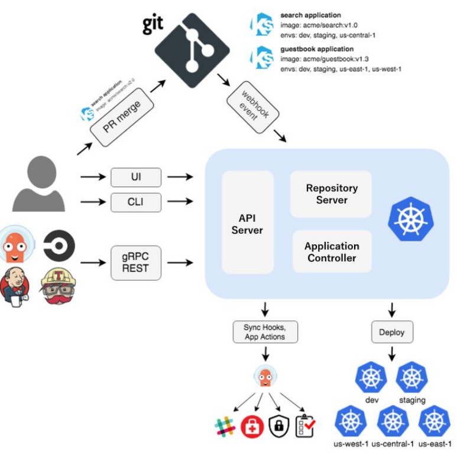

# 🎯𝗔𝗿𝗴𝗼𝗖𝗗 𝗔𝗿𝗰𝗵𝗶𝘁𝗲𝗰𝘁𝘂𝗿𝗲: 𝗧𝗵𝗲 𝗕𝘂𝗶𝗹𝗱𝗶𝗻𝗴 𝗕𝗹𝗼𝗰𝗸𝘀 𝗼𝗳 𝗚𝗶𝘁𝗢𝗽𝘀

we will understand about 𝗔𝗿𝗴𝗼𝗖𝗗 architecture.

𝗔𝗿𝗴𝗼𝗖𝗗 consists of three main components:

∘ 𝘼𝙋𝙄 𝙎𝙚𝙧𝙫𝙚𝙧
∘ 𝙍𝙚𝙥𝙤𝙨𝙞𝙩𝙤𝙧𝙮 𝙎𝙚𝙧𝙫𝙚𝙧
∘ 𝘼𝙥𝙥𝙡𝙞𝙘𝙖𝙩𝙞𝙤𝙣 𝘾𝙤𝙣𝙩𝙧𝙤𝙡𝙡𝙚𝙧

∘ 𝘼𝙋𝙄 𝙎𝙚𝙧𝙫𝙚𝙧: The API Server in ArgoCD is like the central hub that connects everything together. It provides an interface that the Web UI, command-line tools, and CI/CD systems use to interact with ArgoCD. It has the following responsibilities:

• application management and status reporting
• invoking of application operations (e.g. sync, rollback, user-defined actions)
• repository and cluster credential management (stored as K8s secrets)
• authentication and auth delegation to external identity providers
• RBAC enforcement
• listener/forwarder for Git webhook events

∘ 𝙍𝙚𝙥𝙤𝙨𝙞𝙩𝙤𝙧𝙮 𝙎𝙚𝙧𝙫𝙚𝙧: The repository server is an internal service which maintains a local cache of the Git repository holding the application manifests. It is responsible for generating and returning the Kubernetes manifests when provided the following inputs:

• repository URL
• revision (commit, tag, branch)
• application path
• template specific settings: parameters, helm values.yaml

 𝘼𝙥𝙥𝙡𝙞𝙘𝙖𝙩𝙞𝙤𝙣 𝘾𝙤𝙣𝙩𝙧𝙤𝙡𝙡𝙚𝙧: The application controller is a Kubernetes controller which continuously monitors running applications and compares the current, live state against the desired target state (as specified in the repo). It detects 𝗢𝘂𝘁𝗢𝗳𝗦𝘆𝗻𝗰 application state and optionally takes corrective action. It is responsible for invoking any user-defined hooks for lifecycle events (PreSync, Sync, PostSync).

 