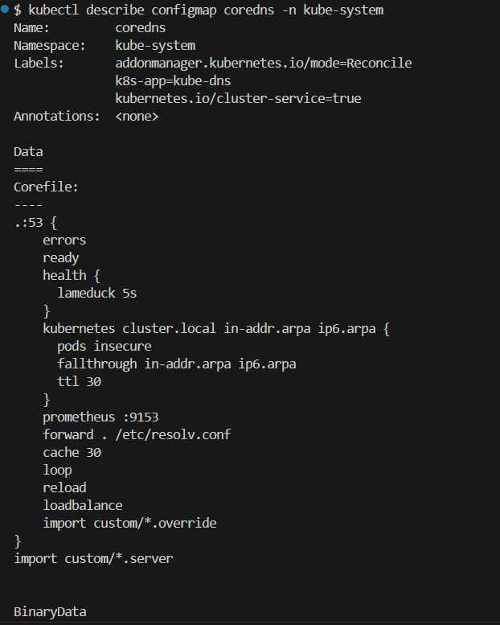
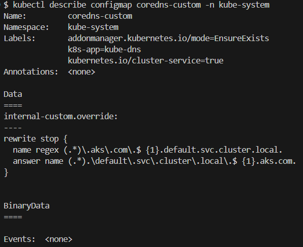

What is CoreDNS?

    Part of the cloud native Foundation. Mostly used for service Discovery within Kubernetes.
    Highly Flexible Due to its plugin system


# Kubernetes CoreDNS Custom Domains
    CoreDNS integrates with Kubernetes via the Kubernetes plugin, or with etcd with the etcd plugin.
    CoreDNS is already installed in Kubernetes
    There are 2 Core-DNS available in k8s.

    1. coredns - it will be managed by provider
    2. coredns-custom - this is available for user customization


# How DNS works in Kubernetes?

    1. DNS is a built-in Kubernetes service launched automatically using the addon manager
    2. Kubernetes creates DNS records for services and pods automatically
    3. kubelet configures pods DNS entry, so that running containers can lookup services by name rather than IP
    4. DNS queries may be expanded using the Pod’s /etc/resolv.conf. kubelet configures this file on each pod
    5. Kubernetes DNS add-ons currently support forward lookups (A records), port lookups (SRV records), reverse IP address (PTR records)

# How to deploy CoreDNS in kubernetes?

    1. CoreDNS is deployed in a simple way
    2. It runs as a cluster-level Pod and handles DNS queries within the cluster from there.
    3. By default, the service is named kube-dns and 1 or more pods are created

command

    kubectl get all -n kubesystem -o wide |grep core
    kubectl -n kube-system get service
    # cluster ip is used to resolve the dns query
    kubectl -n kubesystem get configmap
    # coredns configmap is bind with the deployment, in future if any  pods go down, replicaset with attach this configmap to the pods


Read More About CoreDNS 

    https://kubernetes.io/docs/tasks/administer-cluster/dns-custom-nameservers/#coredns

# How Kubernetes works?

The kube-dns service listens for service and endpoint events from Kubernetes API and updates its DNS records as needed.
These events are triggered when you create, update or delete Kubernetes services and their associated pods
A pod would have record 

```jsx
POD-IP.namespace.pod.cluster.local.

```

A service record
```jsx
SERVICE-IP.namespace.svc.cluster.local.
```


Demo


# ndots
Number of dots in a query name to consider as a FQDN
Whenever a query is forwarded to pods it will search in “search” if not found forwarded to root server

# How to login into DNS pods?
Demo

    kubectl -n kube-system get pods -o wide |grep core
    kubectl get pods/<podname> -n kube-system -o=jsonpath="{range.items[*]}{.spec.containers[].name}";echo
    kubectl -n kube-system debug -it <pod name> --image=busybox:1.28 --target=coredns


# Custom domain names using Kubernetes CoreDNS
The objective of this demo is to use CoreDNS to provide custom domain names inside the cluster. We can replace the service named myapp.default.svc.cluster.local to something like mayapp.aks.com.

    kubectl get pods,service,configmap -n kube-system -l=k8s-app=kube-dns
    NAME                           READY   STATUS    RESTARTS   AGE
    pod/coredns-846bdb68cd-59q7s   1/1     Running   0          19h
    pod/coredns-846bdb68cd-csh2w   1/1     Running   0          19h

    NAME               TYPE        CLUSTER-IP   EXTERNAL-IP   PORT(S)         AGE
    service/kube-dns   ClusterIP   10.0.0.10    <none>        53/UDP,53/TCP   20h

    NAME                       DATA   AGE
    configmap/coredns          1      20h
    configmap/coredns-custom   1      20h

CoreDNS configuration is saved into a configmap.

    kubectl describe configmap coredns -n kube-system



To provide a custom confiuration, we can use the coredns-custom confgmap

    kubectl describe configmap coredns-custom -n kube-system





Let us start by creating a demo app: a deployment and a service called nginx.

    kubectl create deployment nginx --image=nginx --replicas=3
    # deployment.apps/nginx created

    kubectl expose deployment nginx --name nginx --port=80
    # service/nginx exposed

    kubectl get deploy,svc
    # NAME                    READY   UP-TO-DATE   AVAILABLE   AGE
    # deployment.apps/nginx   3/3     3            3           36s

    # NAME                 TYPE        CLUSTER-IP     EXTERNAL-IP   PORT(S)   AGE
    # service/kubernetes   ClusterIP   10.0.0.1       <none>        443/TCP   7h30m
    # service/nginx        ClusterIP   10.0.235.219   <none>        80/TCP    16s

Now let us create and deploy a custom domain name resolvable inside kubernetes.
    kubectl apply -f coredns-custom.yaml

Let us try to resolve the service name from a test pod inside kubernetes.
    kubectl exec -it nginx -- curl http://nginx
    <!DOCTYPE html>
    <html>
    <head>
    <title>Welcome to nginx!</title>
    <style>
    html { color-scheme: light dark; }
    body { width: 35em; margin: 0 auto;

Let us try to resolve the service name from a test pod inside kubernetes.

    kubectl exec -it nginx -- curl http://nginx.default.svc.cluster.local
    <!DOCTYPE html>
    <html>
    <head>
    <title>Welcome to nginx!</title>
    <style>

Let us now try to resolve using the custom domain *.aks.com

     kubectl exec -it nginx -- curl http://nginx.default.aks.com 
    <!DOCTYPE html>
    <html>
    <head>
    <title>Welcome to nginx!</title>
    <style>
    html { color-scheme: light dark; }
    body { width: 35em; margin: 0 auto;
    font-family: Tahoma, Verdana, Arial, sans-serif; }
    </style>


TO-DO

Note in the previous example, we should put the namespace name as a prefix to the domain name. Let us resolve the custom service name but without a namespace prefix.


