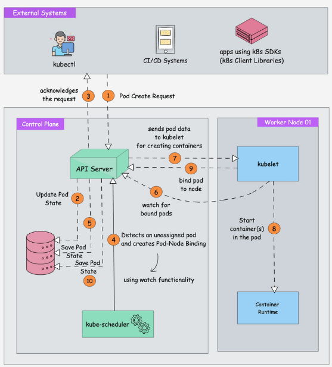

# Kube Scheduler Workflow

When you deploy a pod, You specify the pod requirements such as CPU, memory, volume mounts, etc.
The kube-scheduler is responsible for scheduling pods on worker nodes.
The scheduler is responsible for scheduling pods on worker nodes.
The scheduler's primary task is to identify the unscheduled pods(thos that don't have an assigned node yet) and find the best suited node in the cluster for each pod.

Here is the high-level, step by step scheduler workflow
- the process begins when an external system(like kubectl or CI/Cd system) sends a request to create a new pod.
- The kube-api server receives this request and saves the pod state to etcd
- the api server sends an acknowdgement back to the external system.

- The Kubernetes scheduler, which is constantly watching for unassigned pods(using watch functionally), noticses the new pod and creates a pod-node binding, deciding which node should run this pod.

- The scheduler updates the pod state in etcd via the api server.

- The kubelet on the selected worker node is watching for bound pods and notices the new assignment

- The api server sends the pod data to the kubelet for creating containers.

- The kubelet instructs the container runtime to start the containers for the pod.

- the Kubelet informs the api server that the pod is now bound to the node.

- The api server updates the final pod state in etcd.

Now, So how does the scheduler select the node out of all worker nodes?

The scheduler chooses a node by evaluating many factors to ensure that pods requirements are met.

For example,
- Resource Requests and limits
- Node Affinity/Anti Affinity
- Taints and tolerations
- volume availability
- Priority and preemption
- Topology Spread constraints

These factors are evaluated during filtering and scoring operations.

